### DeepLabv3 for semantic segmentation
DeepLabv3 (and DeepLabv3 plus) is a state-of-the-art model for performing semantic segmentation, which is the task of labeling each pixel of the input image with a predicted semantic class (e.g. car, dog, table). This is a TensorFlow implementation of DeepLabv3 (and plus) that supports training, evaluating and making inference using a trained model. 

### Usage
##### Clone the Repo
```
git clone git@github.com:chao-ji/tf-deeplabv3.git
```
##### Prepare the dataset
The images (and labels) must be converted to TFRecord format before training, evaluation and inference.

A python script is provided to perform the conversion. For example, to convert images and labels in the `val` split into TFRecord files, run

```
  python scripts/write_tfrecord.py \
    --list_path=/LIST/PATH/FILE.txt \
    --labels_dir=/PATH/TO/LABELS/DIR \
    --images_dir=/PATH/TO/IMAGES/DIR \
    --split=val
```
where `list_path` points to a text file in which each line is a basename of a image-label pair (e.g. `2007_000001` for PASCAL-VOC), `labels_dir` and `images_dir` points to the directories holding label and image files respectively.

##### Install TF-slim
DeepLabv3 is built on top of a classification model that serves as a feature extractor. `tf.slim` must be installed to build the DeepLab model. Follow this [link](https://github.com/tensorflow/models/tree/master/research/slim#installation) for instructions. 

You can download the [checkpoints](https://github.com/tensorflow/models/tree/master/research/slim#pre-trained-models) holding the weights of pre-trained classification models.

Currently the following models are supported as feature extractor:

* [resnet-v1-50](http://download.tensorflow.org/models/resnet_v1_50_2016_08_28.tar.gz)
* [resnet-v1-101](http://download.tensorflow.org/models/resnet_v1_101_2016_08_28.tar.gz)
* [resnet-v2-50](http://download.tensorflow.org/models/resnet_v2_50_2017_04_14.tar.gz)
* [resnet-v2-101](http://download.tensorflow.org/models/resnet_v2_101_2017_04_14.tar.gz)
* [mobilenet-v2](https://storage.googleapis.com/mobilenet_v2/checkpoints/mobilenet_v2_1.0_224.tgz)

##### Training, evaluating and making inferences

To perform **training**, run 
```
  python run_trainer.py \
    --model_variant=resnet_v2_101 \
    --filenames=/PATH/TO/TFRECORD_FILE1 \
    --filenames=/PATH/TO/TFRECORD_FILE2 \
    --filenames=/PATH/TO/TFRECORD_FILE3 \
    --load_ckpt_path=/PATH/TO/CLASSIFICATION_MODEL.ckpt \
    --output_path=/OUTPUT/PATH
```
`filenames` points to an input TFRecord file. You may use the `--filenames` flags as many times as the number of TFRecord files. `--load_ckpt_path` points to the checkpoint file of a pre-trained classification model. Run `python run_trainer.py --help` for a complete list of flags with help info.

The trained weights are saved to checkpoint file under directory specified by `--output_path` (Default is `/tmp/deeplabv3`).

To perform **evaluation**, run 
```
  python run_evaluator.py \
    --model_variant=resnet_v2_101 \
    --filenames=/PATH/TO/VAL_TFRECORD_FILE1 \
    --filenames=/PATH/TO/VAL_TFRECORD_FILE2 \
    --ckpt_path=/PATH/TO/DEEPLABV3_MODEL.ckpt
```
The mean Intersection-Over-Union will be reported.
`--ckpt_path` points to the checkpoint file of a trained DeepLabv3 file.

To make **inferences**, run
```
  python run_inferencer.py \
    --input_file_list=/PATH/TO/TEXT_FILE.txt \
    --ckpt_path=/PATH/TO/DEEPLABV3_MODEL.ckpt
```
The input images to inferencer can be raw jpg images (instead of TFRecord files). They must be listed in `/PATH/TO/TEXT_FILE.txt` (i.e. one file name per line). The output image files (with semantic predictions) will be saved to directory specified by `--output_path` (Default is `/tmp/deeplabv3/pred`).


### Remarks on memory footprint
DeepLabv3 has a very large memory footprint at the time of training, mainly because a large (>= 12) batch size is needed to effectively train the batch normalization weights. However there are a number of options, at the cost of accuracy, to reduce memory consumption at training time so that your model fits in the GPU memory.
* Reduce the crop size of images. Default crop size is 513. You may consider values such as 481, 385.
* Use smaller backbone feature extractor (mobilenet-v2 uses much less memory).
* Disable the decoder module. The decoder module can be disable by setting `--use_decoder=False`.
* Disable the atrous convolution in atrous spatial pyramid pooling module by setting `--atrous_rates=None`.

### Experiments

#####Sample input and output of Pascal VOC 2012 val
<p align="center">  </p>
<p align="center">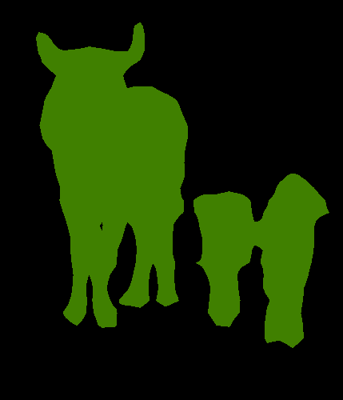 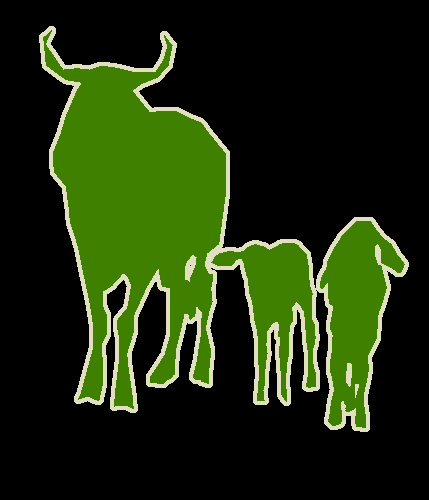 </p>
<p align="center">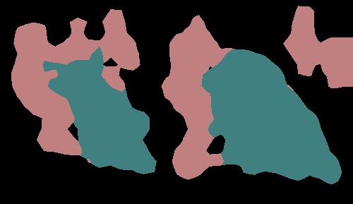 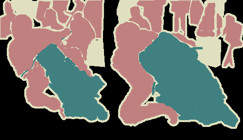 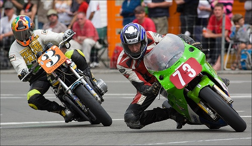</p>
<p align="center">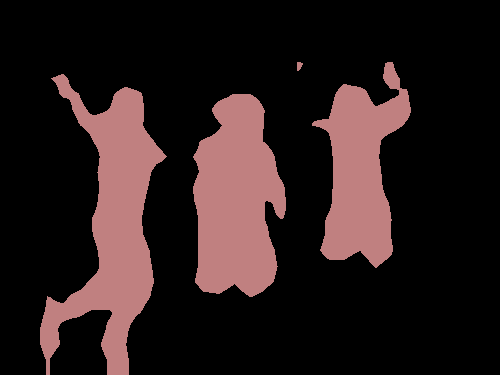  </p>
<p align="center">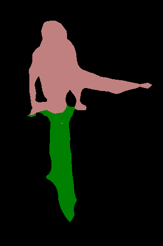 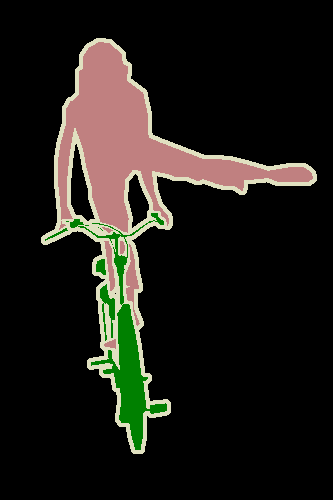 </p>
<p align="center">  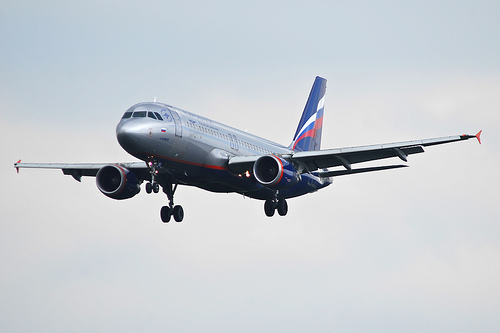</p>
<p align="center">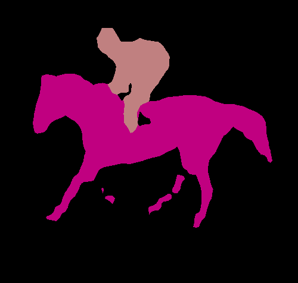  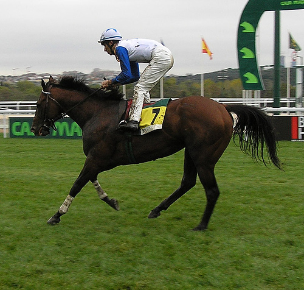</p>
<p align="center">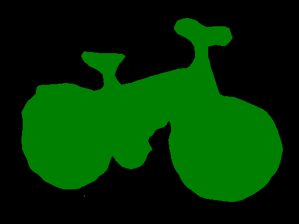  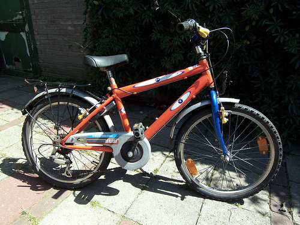</p>

### References
* DeepLabv3: Rethinking Atrous Convolution for Semantic Image Segmentation, Chen *et al.*, arXiv: 1706.05587, 2017
* DeepLabv3+: Encoder-Decoder with Atrous Separable Convolution for Semantic Image Segmentation, Checn *et al.*, arXiv: 1802.02611, 2018
* DeepLabv3 official tensorflow implementation: https://github.com/tensorflow/models/tree/master/research/deeplab
