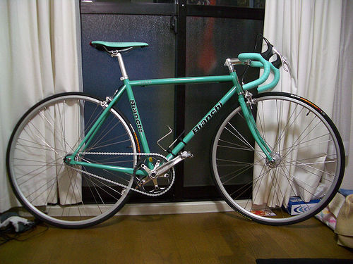
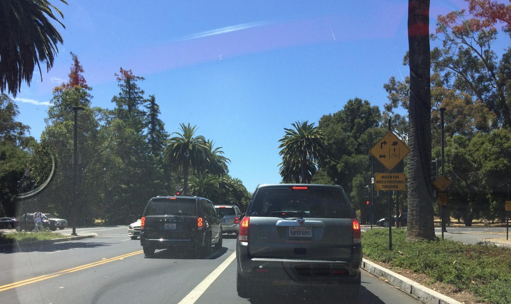

### DeepLabv3 for semantic segmentation
DeepLabv3 (and DeepLabv3 plus) is a state-of-the-art model for performing semantic segmentation, which is the task of labeling each pixel of the input image with a predicted semantic class (e.g. car, dog, table). This is a TensorFlow implementation of DeepLabv3 (and plus) that supports training, evaluating and making inference using a trained model. 

### Usage
##### Clone the Repo
```
git clone git@github.com:chao-ji/tf-deeplabv3.git
```
##### Prepare the dataset
The images (and labels) must be converted to TFRecord format before training, evaluation and inference.

A python script is provided to perform the conversion. For example, to convert images and labels in the `val` split into TFRecord files, run

```
  python scripts/write_tfrecord.py \
    --list_path=/LIST/PATH/FILE.txt \
    --labels_dir=/PATH/TO/LABELS/DIR \
    --images_dir=/PATH/TO/IMAGES/DIR \
    --split=val
```
where `list_path` points to a text file in which each line is a basename of a image-label pair (e.g. `2007_000001` for PASCAL-VOC), `labels_dir` and `images_dir` points to the directories holding label and image files respectively.

##### Install TF-slim
DeepLabv3 is built on top of a classification model that serves as a feature extractor. `tf.slim` must be installed to build the DeepLab model. Follow this [link](https://github.com/tensorflow/models/tree/master/research/slim#installation) for instructions. 

You can download the [checkpoints](https://github.com/tensorflow/models/tree/master/research/slim#pre-trained-models) holding the weights of pre-trained classification models.

Currently the following models are supported as feature extractor:

* [resnet-v1-50](http://download.tensorflow.org/models/resnet_v1_50_2016_08_28.tar.gz)
* [resnet-v1-101](http://download.tensorflow.org/models/resnet_v1_101_2016_08_28.tar.gz)
* [resnet-v2-50](http://download.tensorflow.org/models/resnet_v2_50_2017_04_14.tar.gz)
* [resnet-v2-101](http://download.tensorflow.org/models/resnet_v2_101_2017_04_14.tar.gz)
* [mobilenet-v2](https://storage.googleapis.com/mobilenet_v2/checkpoints/mobilenet_v2_1.0_224.tgz)

##### Training, evaluating and making inferences

To perform **training**, run 
```
  python run_trainer.py \
    --model_variant=resnet_v2_101 \
    --filenames=/PATH/TO/TFRECORD_FILE1 \
    --filenames=/PATH/TO/TFRECORD_FILE2 \
    --filenames=/PATH/TO/TFRECORD_FILE3 \
    --load_ckpt_path=/PATH/TO/CLASSIFICATION_MODEL.ckpt \
    --output_path=/OUTPUT/PATH
```
`filenames` points to an input TFRecord file. You may use the `--filenames` flags as many times as the number of TFRecord files you have. `--load_ckpt_path` points to the checkpoint file of a pre-trained classification model. Run `python run_trainer.py --help` for a complete list of flags with help info.

The trained weights are saved to checkpoint file under directory specified by `--output_path` (Default is `/tmp/deeplabv3`).

To perform **evaluation**, run 
```
  python run_evaluator.py \
    --model_variant=resnet_v2_101 \
    --filenames=/PATH/TO/VAL_TFRECORD_FILE1 \
    --filenames=/PATH/TO/VAL_TFRECORD_FILE2 \
    --ckpt_path=/PATH/TO/DEEPLABV3_MODEL.ckpt
```
The mean Intersection-Over-Union will be reported.
`--ckpt_path` points to the checkpoint file of a trained DeepLabv3 model.

To make **inferences**, run
```
  python run_inferencer.py \
    --input_file_list=/PATH/TO/TEXT_FILE.txt \
    --ckpt_path=/PATH/TO/DEEPLABV3_MODEL.ckpt
```
The input images to inferencer can be raw jpg images (instead of TFRecord files). They must be listed in `/PATH/TO/TEXT_FILE.txt` (i.e. one file name per line). The output image files (with semantic predictions) will be saved to directory specified by `--output_path` (Default is `/tmp/deeplabv3/pred`).


### Remarks on memory footprint
DeepLabv3 has a very large memory footprint at the time of training, mainly because a large (>= 12) batch size is needed to effectively train the batch normalization weights. However there are a number of options, at the cost of accuracy, to reduce memory consumption at training time so that your model fits in the GPU memory.
* Reduce the crop size of images. Default crop size is 513. Although any positive integers would work, it is recommended to use values `n` such that `n = output_stride * m + 1` (`m` is positive integer). For example, 481, 449 for `output_stride = 16`.
* Use smaller backbone feature extractor (mobilenet-v2 uses much less memory).
* Disable the decoder module. The decoder module can be disable by setting `--use_decoder=False`.
* Disable the atrous convolution in atrous spatial pyramid pooling module by leaving out the `--atrous_rates` flag.
* Use larger output stride. Output stride determines the degree to which the spatial resolution of the original image is reduced by the feature extractor. Default output stride is 16 (with corresponding atrous_rates `[6, 12, 18]`). If that value does not work, consider setting the output stride to 32 (with corresponding atrous_rates `[3, 6, 9]`). 

### Experiments

#### Semantic Segmentation on PASCAL VOC2012 val split
Color map: [pascalvoc_colormap.pdf](files/pascalvoc_colormap.pdf)

The DeepLabv3 model was trained on the [augmented training set](http://home.bharathh.info/pubs/codes/SBD/download.html) (1464 + 9118), and evaluated on the val split of VOC 2012 (1449) in terms of mean IOU:

|feature extractor|training output stride|test output stride|crop size|atrous rates in ASPP|decoder module|mIOU|
|-|-|-|-|-|-|-|
|resnet_v2_101|16|16|465|6, 12, 18|Yes|0.7608|
|mobilenet_v2|16|16|513|None|None|0.7099|

Note:
* The reuslts are single-scale, without using multi-grid (See DeepLabv3 paper) and postprocessing.
* ResNet v2 101: Because of memory constraint, a small training batch size (12) and crop size (465) was used. You may get better results if you can afford to use a larger batch size and full crop size (513) on your device.

**Sample input and output of Pascal VOC 2012 val** (output, groundtruth, image):
<p align="center">  </p>
<p align="center">  </p>
<p align="center">  </p>
<p align="center">  </p>
<p align="center">  </p>
<p align="center">  </p>
<p align="center">  </p>
<p align="center">  </p>
<p align="center">  </p>
<p align="center">  </p>
<p align="center">  </p>
<p align="center">  </p>

#### Fine tune on trainval split
The deeplabv3 model trained on the agumented training set is then fine-tuned on the VOC2012 train-val split using a smaller initial learning rate (`1e-4`), where `--fine_tune_batch_norm` is set to `False` and `--output_stride` set to 8 (with atrous rates doubled). In the case, you don't have to use a large batch size that is otherwise needed to ensure the accuracy of the estimation of mean and variance over a minibatch. Those statistics are just read from the checkpoint and used to compute the normalization during forward pass.


Below are sample predictions.   

**VOC2012 test split and some non-VOC images:** (train-val output stride 8, train-aug output stride 16, image)
<p align="center">  </p>
<p align="center">  </p>
<p align="center">  </p>
<p align="center">  </p>
<p align="center">  </p>
<p align="center">  </p>
<p align="center">  </p>
<p align="center">  </p>

We can see that the model fine-tuned on the train-val set with output stride 8 captures more subtle curvatures along object boundaries, and the improvment on certain objects like bikes, which have more fine-detailed structures, is even more noticeable.

#### Semantic Segmentation on ADE20K val split
Color map: [ade20k_colormap.pdf](files/ade20k_colormap.pdf)


The DeepLabv3 model was trained on the train split (20206), and evaluated on the val split (2000) in terms of mean IOU:

|feature extractor|training output stride|test output stride|crop size|atrous rates in ASPP|decoder module|mIOU|
|-|-|-|-|-|-|-|
|resnet_v2_101|16|8|433|5, 10, 15|Yes|0.3914|

Sample prediction:

<p align="center"> </p>

### Updates
---
#### Feb 10, 2019
1. The weights can now be restored from a segmentation checkpoint by specifying `--restore_from_seg_model=True`.
2. Added manual stepping for learning rate schedule. For example
```bash
python run_trainer.py \
--boundaries=60000 \
--boundaries=80000 \
--init_learning_rate=7e-3 \
--rates=7e-4 \
--rates=7e-5
```  
The learning rate is decayed to `7e-4` and `7e-5` at step 60000 and 80000 respectively.


### References
* **DeepLabv3**: Rethinking Atrous Convolution for Semantic Image Segmentation, Chen *et al.*, arXiv: 1706.05587, 2017
* **DeepLabv3+**: Encoder-Decoder with Atrous Separable Convolution for Semantic Image Segmentation, Checn *et al.*, arXiv: 1802.02611, 2018
* **DeepLabv3 official tensorflow implementation**: https://github.com/tensorflow/models/tree/master/research/deeplab
